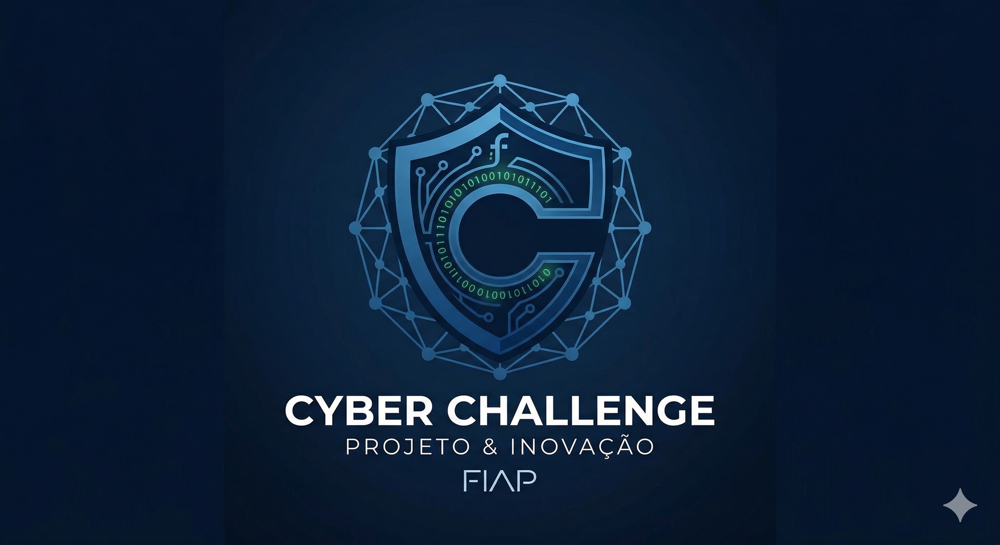
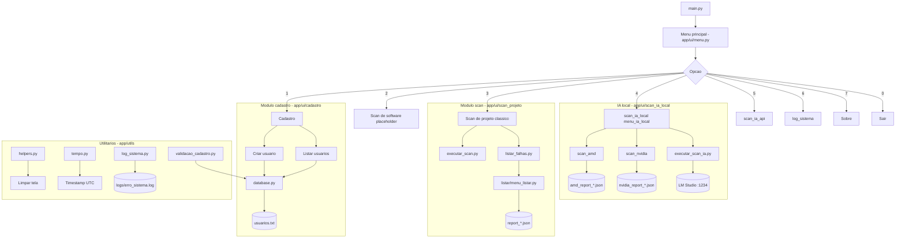
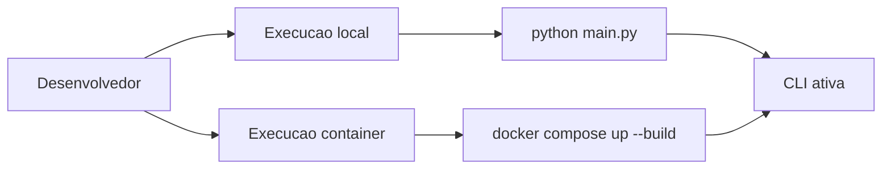

# 🐍 01 - ASPM IA - Python API Core

<p align="center">
  
</p>

<p align="center">
  
  
  
</p>

<p align="center">
  <a href="../README.md">🏠 README Raiz</a> •
  <a href="../documentacao/README.md">📚 Dicionario</a> •
  <a href="../documentacao/08-ia-local-amd-nvidia.md">🤖 IA local + GPU</a> •
  <a href="#-como-executar">🚀 Como Executar</a> •
  <a href="#-roadmap--proximos-passos">🗺️ Roadmap</a>
</p>

---

## 📖 Sobre o Modulo
Este diretório contém o **Core da API Python** do projeto **ASPM IA FIAP - Desafio Pride 2026**. Atualmente, o projeto está em suas fases iniciais ("engatinhando"), focando na estrutura base de gerenciamento de usuários e segurança de ativos.

O objetivo futuro é integrar motores de busca de vulnerabilidades e análise de postura de segurança (ASPM) em uma interface CLI intuitiva e containerizada.

### ✅ Estado atual implementado

- logger central em `app/utils/log_sistema.py` com escrita em `logs/erro_sistema.log` (UTC);
- menu dedicado para consulta de logs em `app/ui/log_sistema/menu_log_sistema.py`;
- validacao e normalizacao de cadastro em `app/utils/validacao_cadastro.py`;
- scanner com filtro por tipo/gravidade e exportacao de relatorio filtrado em `app/ui/scan_projeto/listar/`;
- **IA local (GPU)**: `app/ui/scan_ia_local/` com modos **AMD** / **NVIDIA** (pre-selecao **NVIDIA** se `nvidia-smi` responder), relatorios em `logs/amd/reports/` e `logs/nvidia/reports/`, trilha por placa em `logs/*/system/sistema_*.log`, e chamadas HTTP ao **LM Studio** (`localhost:1234`);
- suporte a testes com `pytest` em `tests/`.

---

## 🏗️ Arquitetura do Modulo (Fase Atual)

Abaixo, os diagramas em Mermaid adaptados para renderizacao no GitHub:





---

## 🛠️ Tecnologias e Ferramentas

| Tecnologia | Descrição | Ícone |
| :--- | :--- | :---: |
| **Python** | Linguagem base do projeto |  |
| **Docker** | Containerização e isolamento |  |
| **Colorama** | Interface CLI colorida |  |
| **Text DB** | Persistência simples via arquivo .txt |  |

---

## 📂 Estrutura de Pastas

```text
api_python/
├── app/
│   ├── ui/               # Interface de Usuário (CLI)
│   │   ├── menu.py       # Menu principal
│   │   ├── cadastro/     # Cadastro/listagem de usuários
│   │   ├── scan_projeto/ # Scan, listagem e filtros de alertas
│   │   ├── scan_ia_local/# Scan + IA local (AMD/NVIDIA) + LM Studio
│   │   ├── scan_ia_api/  # Scan + IA via API (evolucao)
│   │   ├── log_sistema/  # Consulta de logs no terminal
│   │   └── sobre/        # Informações institucionais
│   └── utils/            # Tempo, logger (central + por GPU), validações e helpers
├── logs/                 # Criado em runtime: erro_sistema.log; amd|nvidia → system/ + reports/
├── tests/                # Testes automatizados com pytest
├── main.py               # Ponto de entrada da aplicação
├── requirements.txt      # Dependências do projeto
├── Dockerfile            # Configuração da imagem Docker
└── docker-compose.yml    # Orquestração do container
```

---

## 🚀 Como Executar

### 🐳 Via Docker (Recomendado)
Para rodar o ambiente completamente isolado e interativo:

```bash
docker compose up --build
```

### 🐍 Via Python Local
1. Crie um ambiente virtual:
   ```bash
   python -m venv .venv
   ```
2. Instale as dependências:
   ```bash
   pip install -r requirements.txt
   ```
3. Execute:
   ```bash
   python main.py
   ```

### 🧪 Testes automatizados (pytest)

```bash
pytest tests/ -q
```

Testes focados:

```bash
pytest tests/test_validacao_cadastro.py -v
pytest tests/test_exemplo_scan.py -v
```

---

## 📈 Roadmap / Próximos Passos
- [x] Estrutura base de pastas.
- [x] CRUD básico de usuários.
- [x] Suporte a Docker.
- [x] Logger central + menu de log no CLI.
- [x] Validação de cadastro com testes automatizados.
- [x] Filtros de scanner com exportação de relatório filtrado.
- [x] Fluxo de IA local documentado (AMD/NVIDIA + LM Studio) — ver `documentacao/08-ia-local-amd-nvidia.md`.
- [ ] Integração com Banco de Dados persistente (SQLite/MongoDB).
- [ ] Evoluir cobertura de assinaturas de vulnerabilidades.
- [ ] Dashboard de logs com IA.

---

<p align="center">
  <b>RM 570877 - Paulo André Carminati</b><br>
  FIAP - 1TDCPV - 2026
</p>
