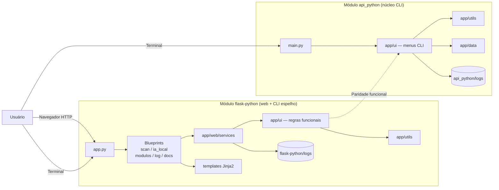
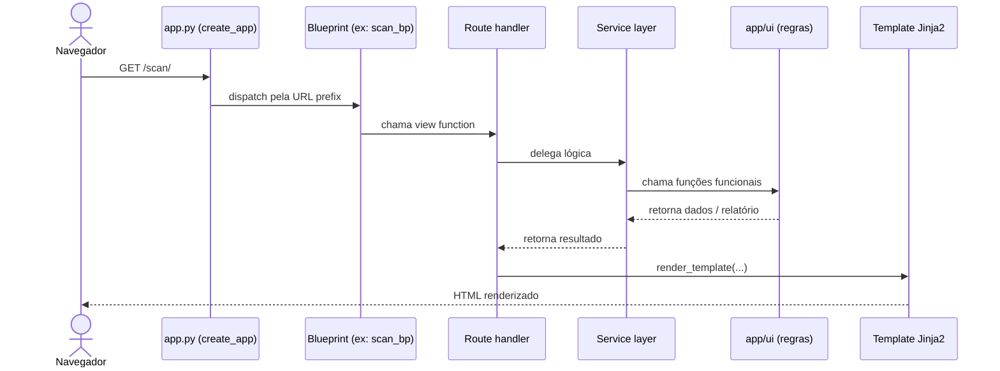
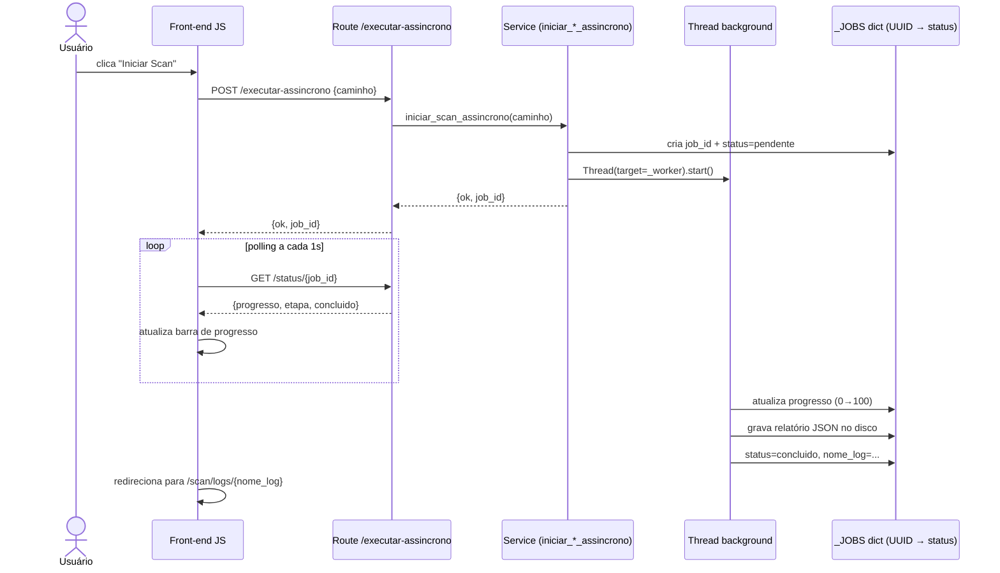
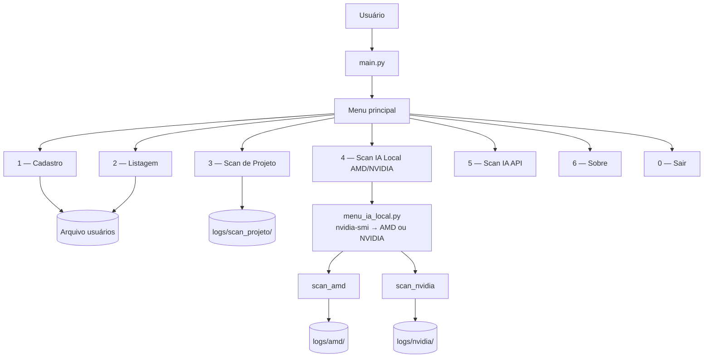
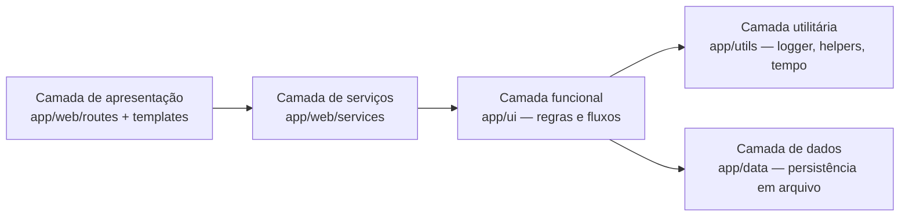
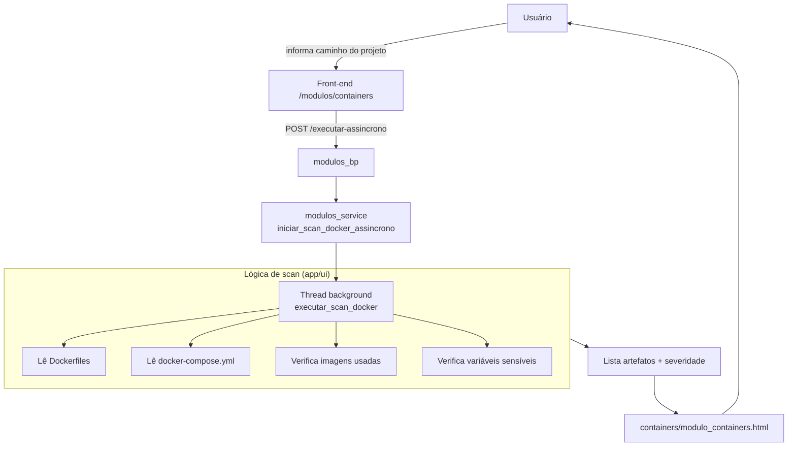
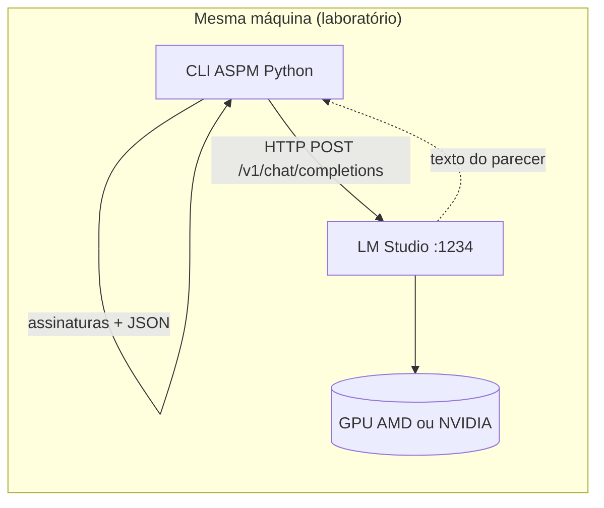
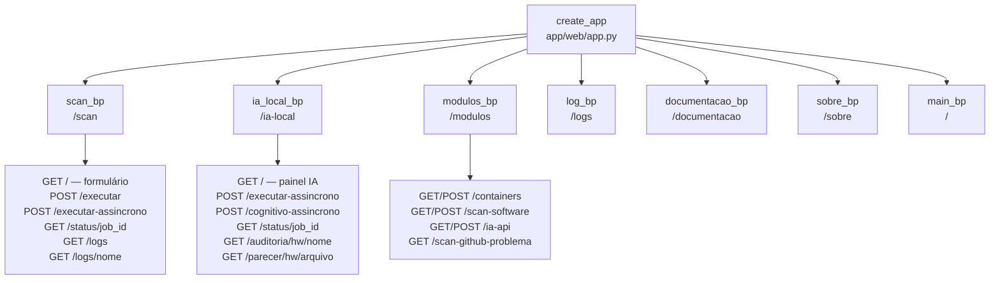

# 🏗️ 08 - Arquitetura Técnica

<p align="left">
  
  
</p>

**Navegação:** [📚 Dicionário](./README.md) • [⚙️ Anterior: Instalação](./02-instalacao-execucao.md) • [🧩 Próximo: Módulos](./04-modulos-responsabilidades.md)

## 🧭 Menu de Diagramas

- [Arquitetura completa (api_python + flask-python)](#arquitetura-completa-api_python--flask-python)
- [Ciclo de vida de requisição HTTP (flask-python)](#ciclo-de-vida-de-requisição-http-flask-python)
- [Fluxo de scan assíncrono com barra de progresso](#fluxo-de-scan-assíncrono-com-barra-de-progresso)
- [Fluxo geral do menu CLI (api_python)](#fluxo-geral-do-menu-cli-api_python)
- [Arquitetura por camadas](#arquitetura-por-camadas)
- [Scan de containers Docker](#scan-de-containers-docker)
- [IA local, GPU e servidor LM Studio](#ia-local-gpu-e-servidor-lm-studio)
- [Execução local e container](#execução-local-e-container)
- [Estrutura de blueprints Flask](#estrutura-de-blueprints-flask)

---

## 📌 Visão da arquitetura

A arquitetura prioriza simplicidade, separação por responsabilidade e facilidade de manutenção. `api_python` define a lógica funcional; `flask-python` adiciona camada web sem duplicar regras.

---

## 🗺️ Diagramas (Mermaid)

### Arquitetura completa (api_python + flask-python)



---

### Ciclo de vida de requisição HTTP (flask-python)

Mostra como uma requisição do navegador percorre as camadas até a resposta HTML.



---

### Fluxo de scan assíncrono com barra de progresso

Usado em scan de projeto, IA local e scan de containers. O front-end faz polling do status via JSON.



---

### Fluxo geral do menu CLI (api_python)



---

### Arquitetura por camadas



---

### Scan de containers Docker



---

### IA local, GPU e servidor LM Studio

Visão resumida do módulo `scan_ia_local` (detalhes, URLs e checklist em [13 - IA local com GPU](./08-ia-local-amd-nvidia.md)):



---

### Execução local e container

```mermaid
flowchart LR
    subgraph Dev["Desenvolvimento local"]
        D1[python app.py] --> FLASK[Flask :5000]
        D2[python main.py] --> CLI_APP[CLI terminal]
    end

    subgraph Docker["Docker Compose"]
        D3[docker compose up --build] --> C1[Container flask-python :5000]
        D4[docker compose up --build] --> C2[Container api_python]
    end
```



---

### Estrutura de blueprints Flask



---

## 🧱 Camadas principais

| Camada | Pasta | Papel |
|--------|-------|-------|
| Entrada web | `flask-python/app.py` | Factory Flask, registra blueprints |
| Roteamento | `app/web/routes/` | HTTP request → response, validação de entrada |
| Serviços | `app/web/services/` | Adaptam regras funcionais para web, jobs assíncronos |
| Lógica funcional | `app/ui/` | Regras de scan e IA (paridade com api_python) |
| Utilitários | `app/utils/` | Logger, helpers, tempo, validação |
| Dados | `app/data/` | Persistência em arquivo (configurações) |
| Templates | `app/web/templates/` | HTML Jinja2 por módulo (scan/, ia/, log/, etc.) |
| Estáticos | `app/web/static/` | CSS, JS, imagens |

## 🔒 Content-Security-Policy — restrição que molda o front-end

`create_app()` (`flask-python/app/web/app.py`) devolve, em toda resposta, a política abaixo. Ela não é detalhe de segurança: **decide como o front-end pode ser escrito.**

```text
default-src 'self'; script-src 'self'; style-src 'self' 'unsafe-inline';
img-src 'self' data: https://img.shields.io; connect-src 'self'; worker-src blob: 'self';
```

| regra | consequência prática |
|---|---|
| `script-src 'self'` **sem** `'unsafe-inline'` | Bloco `<script>` dentro de template é **bloqueado pelo navegador**. Todo JS mora em arquivo sob `static/js/` e entra por `src`. |
| `default-src 'self'` | CDN, webfont remota e `@import` externo **não carregam**. Toda biblioteca é servida local — é por isso que `mermaid.min.js` está em `static/js/`. |
| `style-src` permite `'unsafe-inline'` | Atributo `style=` inline funciona; ainda assim o CSS fica em `style.css`. |
| `img-src` permite `https://img.shields.io` | Única exceção externa, para os badges do README. |

> **A armadilha desta política é o silêncio.** Script bloqueado não gera erro na tela: a página carrega inteira e o comportamento simplesmente não acontece. Foi assim que os diagramas Mermaid de `/documentacao/` e os botões do terminal de log ficaram inertes — ambos eram `<script>` inline, um deles importando de `cdn.jsdelivr.net`. Ao mexer no front-end, **conferir o console do navegador** é parte do teste, não zelo extra.

Assets são versionados por `?v={{ asset_version('...') }}` (mtime do arquivo, helper registrado em `create_app`). Sem esse parâmetro o navegador serve a versão em cache e a alteração parece não ter surtido efeito.

## 🎨 Sistema de design e unidades relativas

`static/css/style.css` é um sistema de design único: cor, espaçamento, raio, tipografia e movimento saem de tokens declarados em `:root`.

**Não há nenhuma medida em `px`.** A escolha de unidade segue o que cada uma resolve:

| unidade | onde | por quê |
|---|---|---|
| `rem` | tipografia, espaçamento, raio, borda | acompanha o tamanho de fonte configurado pela pessoa no navegador; `px` ignora essa preferência |
| `clamp()` + `vw` | títulos e margem lateral da página | escala contínua entre telas, sem saltos |
| `%`, `fr`, `minmax()` | largura de layout e grades | é a unidade correta para largura |
| `em` | media queries | o ponto de quebra acompanha o zoom de fonte, não só a largura física |
| `vh` | altura máxima de áreas roláveis | proporcional à janela |

`%` **não** é usado em `padding` nem em `font-size`: porcentagem de padding resolve contra a *largura* do container (padding vertical cresceria com a largura da tela) e porcentagem de fonte *acumula* a cada aninhamento.

## 🎯 Princípios adotados

- Modularidade: cada pasta atende a um papel específico.
- Paridade funcional **parcial e declarada**: `flask-python` e `api_python` compartilham regras sem duplicação, mas o **cadastro de usuários existe só no CLI `api_python`** — foi removido da camada web.
- Jobs assíncronos: scans pesados rodam em threads separadas com polling de status.
- Legibilidade: código orientado a aprendizado e evolução.

## 🚀 Evolução esperada

- Persistência em banco relacional ou NoSQL (substituir `app/data/`).
- Websockets ou SSE para substituir polling de progresso.
- Pipeline de análise com múltiplos modelos de IA.

---

**Próxima leitura recomendada:** [🧩 04 - Módulos e Responsabilidades](./04-modulos-responsabilidades.md)
