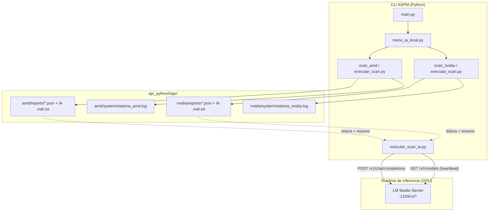
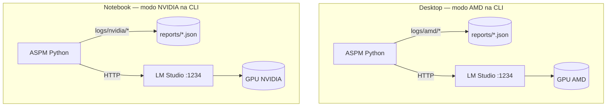
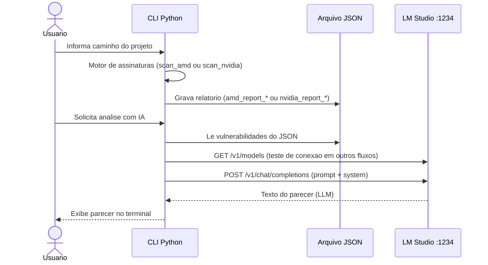

# 🤖 13 - IA local com GPU (AMD e NVIDIA)

<p align="left">
  
  
</p>

**Navegacao:** [📚 Dicionario](./README.md) • [🚀 07 - Roadmap](./07-roadmap.md) • [🏠 README raiz](../README.md)

Este capitulo explica **o que realmente acontece** quando voce usa o fluxo **Scan de Projeto - IA Local** no menu principal (opcao **4**), incluindo os modos **AMD Radeon** e **NVIDIA GeForce**, onde ficam os relatorios e como a GPU entra na historia.

---

## Estado atual do laboratorio (NVIDIA + logs por placa)

- **Fluxo NVIDIA (GeForce)**: validado em laboratorio — scan, listagem, parecer IA (LM Studio), exportacao Markdown/TXT e impressao seguem o mesmo padrao do modo AMD.
- **Logs por fabricante**: cada linha de GPU passa a ter **pastas e ficheiros dedicados** sob `api_python/logs/`, separando **trilha de sistema** (`system/sistema_<fabricante>.log`) de **relatorios de scan** (`reports/*.json` e ficheiros `*_AI_*` gerados pela IA).
- **Deteccao automatica**: ao abrir o menu IA Local, o codigo tenta `nvidia-smi`; se o comando existir e responder com sucesso, o **modo predefinido** passa a **NVIDIA**; caso contrario mantem-se **AMD** (util para desktop Radeon sem driver NVIDIA).

---

## 🎯 Objetivo pedagogico

- Mostrar a **separacao de responsabilidades**: scanner por assinaturas (Python) versus **inferencia do modelo** (servidor local que pode usar GPU).
- Deixar explicito o que e **metodo didatico / UX** (cores, nomes de modo AMD vs NVIDIA) versus o que e **integracao tecnica** (HTTP para API compativel com OpenAI).
- Orientar montagem do ambiente (LM Studio, portas, pastas de log) para laboratorio FIAP.

---

## 🧭 Onde isso aparece no codigo

| Caminho | Papel |
| :--- | :--- |
| `api_python/main.py` | Opcao `4` chama `menu_ia_local()`. |
| `api_python/app/ui/menu.py` | Texto do menu principal (opcao 4 = IA Local). |
| `api_python/app/ui/scan_ia_local/menu_ia_local.py` | Roteador: `nvidia-smi` para pre-selecionar GPU, painel AMD/NVIDIA e teste LM Studio. |
| `api_python/app/utils/log_sistema.py` | `get_hardware_logger("amd"\|"nvidia")` — ficheiro **dedicado por fabricante** em `logs/<fabricante>/system/`. |
| `api_python/app/ui/scan_ia_local/executar_scan_ia.py` | Chamadas HTTP ao servidor local (LM Studio). |
| `api_python/app/ui/scan_ia_local/scan_amd/` | Motor AMD: JSON + logger `get_hardware_logger("amd")`. |
| `api_python/app/ui/scan_ia_local/scan_nvidia/` | Motor NVIDIA: JSON + logger `get_hardware_logger("nvidia")`. |

---

## 🏗️ Visao geral da arquitetura (componentes)

O projeto **nao** embute CUDA, ROCm ou drivers dentro do Python da CLI. O fluxo e:

1. **CLI Python** executa regras de assinatura (leitura de arquivos, matching de padroes) nos motores `scan_amd` / `scan_nvidia`.
2. **Relatorio JSON** e gravado em `api_python/logs/amd/reports/` ou `api_python/logs/nvidia/reports/` (nao mistura AMD com NVIDIA no disco).
3. Quando voce pede **analise com IA**, o Python envia um **prompt HTTP** para um **servidor local** (padrao atual: **LM Studio** em `localhost:1234`).
4. **Quem usa a GPU** e, em geral, o **runtime do LM Studio** (ou outro servidor que voce configurar), nao a linha `python main.py` em si.



### Dois laboratorios (desktop AMD vs notebook NVIDIA)

No projeto didatico, **cada modo grava relatorios em pastas diferentes**, o que ajuda quando a turma separa **desktop com Radeon** e **notebook com GeForce**: os JSON nao se misturam e o roteiro de aula fica claro.



> Em cada maquina o LM Studio usa **a GPU local disponivel**. A CLI apenas precisa que `localhost:1234` responda.

---

## 🔁 Diagrama de sequencia (scan + parecer da IA)

Cenario tipico: usuario faz scan, gera JSON, depois usa opcao de **re-analisar** com IA (menus AMD/NVIDIA, opcao **4**).



---

## 🔴 Modo AMD vs 🟢 Modo NVIDIA: o que muda de verdade?

| Aspecto | AMD (`scan_amd`) | NVIDIA (`scan_nvidia`) |
| :--- | :--- | :--- |
| **Motor de assinaturas** | Python + regras locais do pacote AMD | Python + regras locais do pacote NVIDIA |
| **Nome do arquivo de relatorio** | `amd_report_<timestamp>.json` | `nvidia_report_<timestamp>.json` |
| **Pasta de logs** | `app/ui/scan_ia_local/scan_amd/logs/` | `app/ui/scan_ia_local/scan_nvidia/logs/` |
| **Metadado `hardware` no JSON** | Texto estilo AMD Radeon | Texto estilo NVIDIA GeForce |
| **API da IA local** | Mesma base (`executar_scan_ia.py`) | Mesma base (`executar_scan_ia.py`) |

Ou seja: **a alternancia AMD/NVIDIA na CLI serve principalmente para organizacao didatica**, simular dois laboratorios (desktop vs notebook) e **separar artefatos de auditoria**. A **GPU utilizada na inferencia** e a que o **LM Studio** (ou outro servidor) estiver configurado para usar na maquina onde o servidor roda.

> Transparencia: os textos “ROCm/DirectML”, “CUDA”, “TensorRT” nos menus sao **rotulos de UX** alinhados ao tema didatico; a integracao atual no repositorio usa **HTTP** para o endpoint do LM Studio, nao chamadas diretas a APIs nativas de GPU no Python.

---

## 🔌 Servidor local (LM Studio) — requisitos

Arquivo de referencia: `api_python/app/ui/scan_ia_local/executar_scan_ia.py`.

- **URL padrao**: `http://localhost:1234/v1/chat/completions`
- **Heartbeat / modelo**: `GET http://localhost:1234/v1/models`
- **Timeout** do chat: ate **60 s** por requisicao (adequado a modelos maiores em GPU).

### Checklist rapido

1. Instalar [LM Studio](https://lmstudio.ai/) na mesma maquina onde roda `python main.py`.
2. Baixar um modelo (ex.: familias Gemma / Llama adequadas ao seu VRAM).
3. Abrir a aba **Local Server** e iniciar o servidor na porta **1234** (padrao).
4. No ASPM, usar **opcao 3** no menu IA Local para **testar conexao** antes de analisar relatorios.

### AMD vs NVIDIA na pratica (laboratorio)

- **AMD (Windows)**: drivers atualizados; LM Studio costuma usar backends disponiveis na propria aplicacao para a sua GPU.
- **NVIDIA**: driver + CUDA runtime compativel com a build do LM Studio costuma melhorar desempenho em muitos modelos.
- Em ambos os casos, o indicador **“GPU”** no menu significa: **“servidor de inferencia respondeu”** — a utilizacao real de VRAM aparece no **Task Manager** / **GPU-Z** / monitor do proprio LM Studio.

---

## 📂 Arvore de logs por placa (fabricante)

Tudo fica sob **`api_python/logs/`**, ao lado de `erro_sistema.log` (log **central** de toda a aplicacao). A partir desta versao, **AMD** e **NVIDIA** nao partilham a mesma pasta de relatorios nem o mesmo ficheiro de trilha do motor.

```text
api_python/logs/
├── erro_sistema.log                 # Logger raiz ASPM (todos os modulos)
├── amd/
│   ├── system/
│   │   └── sistema_amd.log         # get_hardware_logger("amd") — eventos do motor AMD
│   └── reports/
│       ├── amd_report_YYYYMMDD_HHMMSS.json
│       ├── …_AI_PREMIUM.md         # parecer IA (Markdown)
│       └── …_AI_LEITURA.txt        # parecer IA (texto / impressao)
└── nvidia/
    ├── system/
    │   └── sistema_nvidia.log      # get_hardware_logger("nvidia") — eventos do motor NVIDIA
    └── reports/
        ├── nvidia_report_YYYYMMDD_HHMMSS.json
        ├── …_AI_PREMIUM.md
        └── …_AI_LEITURA.txt
```

- **`system/sistema_<fabricante>.log`**: gravacao tecnica do scan (ex.: confirmacao de escrita do JSON). O logger de hardware tem `propagate = True`, pelo que mensagens **tambem podem aparecer** em `erro_sistema.log` (auditoria unificada + ficheiro por GPU).
- **`reports/`**: unica fonte de verdade para **listar falhas**, **re-analisar** e **imprimir** no menu AMD/NVIDIA (`listar_falhas.py` aponta para estes caminhos).

### Codigo fonte (pastas do repositorio)

```text
api_python/app/ui/scan_ia_local/
├── menu_ia_local.py          # Deteccao nvidia-smi + roteador AMD/NVIDIA
├── executar_scan_ia.py       # Cliente HTTP LM Studio
├── scan_amd/
│   ├── executar_scan.py      # Motor AMD + paths logs/amd/...
│   ├── listar_falhas.py      # Lista JSON em logs/amd/reports
│   └── menu.py
└── scan_nvidia/
    ├── executar_scan.py      # Motor NVIDIA + paths logs/nvidia/...
    ├── listar_falhas.py      # Lista JSON em logs/nvidia/reports
    └── menu.py
```

Apos **scan cognitivo** (opcoes **3** ou **4** nos paineis AMD/NVIDIA), o modulo `executar_scan_ia.py` grava junto ao JSON **na mesma pasta `reports/`** do fabricante:

- `<nome>_AI_PREMIUM.md` — Markdown com **tabelas de metadados** (projeto, caminho, hardware, timestamps UTC/BR/sistema, totais) e texto do LLM;
- `<nome>_AI_LEITURA.txt` — versao simplificada para leitura ou impressao (`notepad /p` no Windows).

O JSON de scan AMD/NVIDIA inclui `schema_version`, `motor_relatorio`, `caminho_total`, `total_arquivos_analisados` e os tres timestamps no **cabecalho do relatorio**, alinhados ao scan classico em `scan_projeto`.

---

## 🧪 Menu AMD / NVIDIA (fluxo ativo em `menu.py`)

Implementado em `scan_amd/menu.py` e `scan_nvidia/menu.py`:

- **Opcao 1**: scan de projeto com barra de progresso e gravacao do JSON (`amd_report_*` / `nvidia_report_*`).
- **Opcao 2**: listar e navegar falhas no JSON.
- **Opcoes 3 e 4**: **3** = scan + parecer IA na sequencia; **4** = reutiliza o **ultimo** JSON da pasta `logs` e gera parecer; amostra de ate **20** achados no prompt (ver `analisar_relatorio_existente`).
- **Opcao 5**: imprimir o ultimo ficheiro `*_AI_LEITURA.txt` (Windows: Notepad em modo impressao).
- **Opcao 0**: voltar.

Ficheiros `menu_amd.py` / `menu_nvidia.py` no mesmo diretorio sao **legado** (nao usados pelo `menu_ia_local`).

---

## 🛡️ Seguranca e privacidade (importante para ASPM)

- **Dados nao saem para nuvem** enquanto voce usar apenas `localhost` — o trafego e local ao loopback.
- O prompt pode incluir **trechos de codigo** dos achados; trate o diretorio do projeto como **sensivel**.
- A resposta do LLM e **heuristica**: serve para **priorizar revisao humana**, nao para substituir analise profissional ou pipeline CI/CD.

---

## 🧯 Problemas comuns

| Sintoma | Causa provavel | Acao |
| :--- | :--- | :--- |
| `DESCONECTADO (LM Studio offline)` | Servidor nao iniciado ou porta diferente | Subir o servidor em LM Studio; conferir `1234`. |
| Timeout / lentidao | Modelo grande ou GPU ocupada | Modelo menor, quantizacao mais agressiva, fechar outros apps GPU. |
| Parecer vazio / erro HTTP | Endpoint ou payload incompativel | Conferir `api_python/logs/erro_sistema.log` e o log do motor em `logs/nvidia/system/sistema_nvidia.log` ou `logs/amd/system/sistema_amd.log`. |

---

## 📚 Leitura relacionada

- [🧩 04 - Modulos e Responsabilidades](./04-modulos-responsabilidades.md) — visao resumida de todos os modulos.
- [🚀 07 - Roadmap](./07-roadmap.md) — evolucoes planejadas do projeto.

---

**Proxima leitura recomendada:** [🧯 06 - Troubleshooting e FAQ](./06-troubleshooting-faq.md) (problemas de ambiente e rede local).
